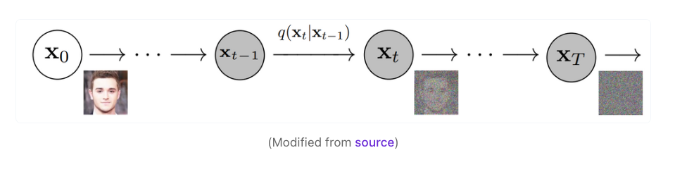
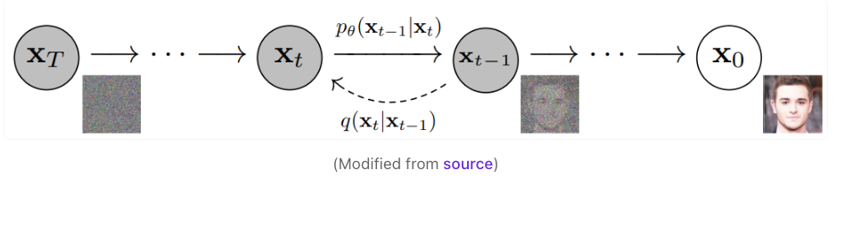
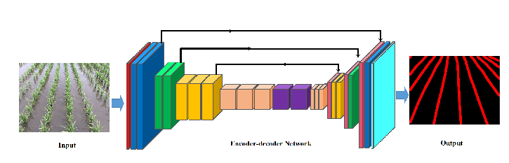
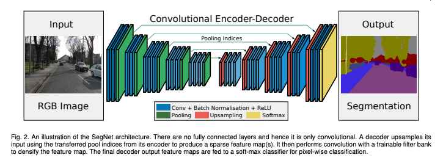

# Simple Diffusion Model

The purpose of this project was to explore diffusion models in depth and construct a small denoising network that can generate novel images. Current diffusion
models are extremely large with dozens of millions parameters and I was curious whether it would be possible to train a decent one with less parameters.

## Background
At their core, diffusion models are generative models similar to GANs or VAEs, in which they generate coherent images through noise. First an image is 
slowly corrupted with Gaussian noise over some number of timesteps. 


<figcaption align ="center"><b>Visual representation of forward process from <a href="https://www.assemblyai.com/blog/diffusion-models-for-machine-learning-introduction/">(1)</a></b></figcaption>
<br></br>
A denoising model is then used to learn how to reverse the noising process and 
reconstruct the original image. The goal is that the diffusion model will be able to generate interpretable images from complete random noise. Models such
as DALLE-2 and Stable Diffusion have added text-conditioning and have built out SOTA image-to-text generation models with diffusion models as their core
image generation model. 


<figcaption align="center"><b>Visual representation of backward process from <a href="https://www.assemblyai.com/blog/diffusion-models-for-machine-learning-introduction/">(1)</a></b></figcaption>
<br></br>


<figcaption align="center"><b>DALLE-2 generated image of an astronaut riding a horse from <a href="https://openai.com/dall-e-2/">(2)</a></b></figcaption>
<br></br>


<figcaption align="center"><b>Images generated by <a href="https://arxiv.org/pdf/2112.10752.pdf">Stable Diffusion</a></b></figcaption>
<br></br>

## Implementation

Traditionally, diffusion models use a U-Net with a variety of convolutional and transformer layers to predict the gaussian noise. However, the beauty of diffusion
models is that any network can be used as a denoising network as long as the input and output tensors have the same shapes. In this implementation, I am attempting to train a simple diffusion model that uses a CNN encoder-decoder architecture to denoise the images. The encoder is 
a Resnet while the decoder is simply three transposed convolution layers. 


<figcaption align="center"><b>CNN Encoder-Decoder Example from <a href="https://www.researchgate.net/figure/Convolutional-encoder-decoder-network-based-detection-of-crop-lines-using-semantic_fig1_340616012">(4)</a></b></figcaption>
<br></br>

Currently the results are just pure Gaussian noise but this network is extremely
lightweight and I am working on slowly scaling it up, until we can generate coherent images with a minimal amount of layers. We train the network on the Stanford
Cars dataset which has 4000+ images of different kinds of cars. Next, I am planning to consider networks like SegNet which are deep encoder-decoder convolutional
networks as I suspect that 3 transposed convolution layers isn't sufficient for decoding the Resnet encoded representation. While this model will be much deeper
than the current implementation, it will still be much more lightweight than a U-Net.


<figcaption align="center"><b><a href="https://arxiv.org/pdf/1511.00561.pdf">Segnet</a> Architecture</b></figcaption>
<br></br>

## Citations

### Papers
```
@misc{https://doi.org/10.48550/arxiv.1511.00561,
  doi = {10.48550/ARXIV.1511.00561},
  url = {https://arxiv.org/abs/1511.00561},
  author = {Badrinarayanan, Vijay and Kendall, Alex and Cipolla, Roberto},
  keywords = {Computer Vision and Pattern Recognition (cs.CV), Machine Learning (cs.LG), Neural and Evolutionary Computing (cs.NE), FOS: Computer and information sciences, FOS: Computer and information sciences},
  title = {SegNet: A Deep Convolutional Encoder-Decoder Architecture for Image Segmentation},
  publisher = {arXiv},
  year = {2015},
  copyright = {arXiv.org perpetual, non-exclusive license}
}
```

```
@misc{https://doi.org/10.48550/arxiv.2006.11239,
  doi = {10.48550/ARXIV.2006.11239},
  url = {https://arxiv.org/abs/2006.11239},
  author = {Ho, Jonathan and Jain, Ajay and Abbeel, Pieter},
  keywords = {Machine Learning (cs.LG), Machine Learning (stat.ML), FOS: Computer and information sciences, FOS: Computer and information sciences},
  title = {Denoising Diffusion Probabilistic Models},
  publisher = {arXiv},
  year = {2020},
  copyright = {arXiv.org perpetual, non-exclusive license}
}
```

```
@conference{nokey,
title = {High-Resolution Image Synthesis with Latent Diffusion Models},
author = {Robin Rombach and Andreas Blattmann and Dominik Lorenz and Patrick Esser and Björn Ommer},
url = {https://github.com/CompVis/latent-diffusionhttps://arxiv.org/abs/2112.10752},
year  = {2022},
booktitle = {Proceedings of the IEEE Conference on Computer Vision and Pattern Recognition (CVPR)},
}
```

### Websites

(1) https://openai.com/dall-e-2/

(2) https://www.assemblyai.com/blog/diffusion-models-for-machine-learning-introduction/

(3) https://www.assemblyai.com/blog/minimagen-build-your-own-imagen-text-to-image-model/

(4) https://www.researchgate.net/figure/Convolutional-encoder-decoder-network-based-detection-of-crop-lines-using-semantic_fig1_340616012
